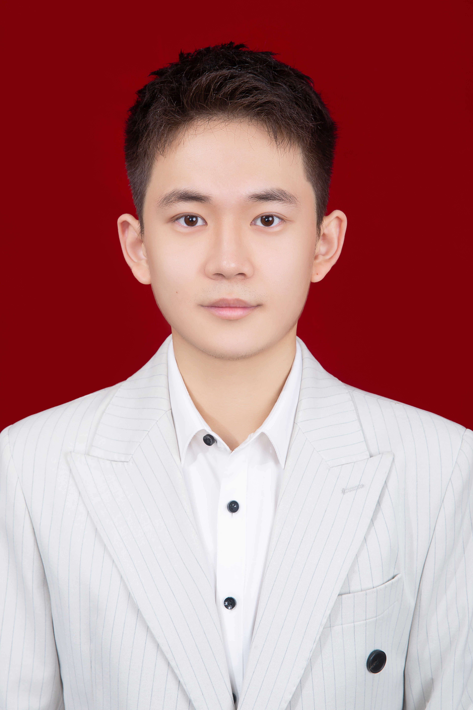

  
  <h1>Junhan's Blog (宁俊涵)</h1>
  
<strong>欢迎来到宁俊涵的博客！</strong>

---

### 👋 关于我 (About Me)

你好！我是**宁俊涵 (Junhan Ning)**。

目前是北京邮电大学计算机学院大二学生，欢迎一起交流！

在这里你会看到：
- 北邮人论坛一些精选内容
- 杂七杂八的总结与笔记

 

---

### 📝 博文列表 (Posts)

#### 【北邮人论坛精选内容】
- 📄 [如何进行科研学术阅读](https://cubewatermelon.github.io/post/%E3%80%90-ke-yan-gan-shou-%E3%80%91-ru-he-jin-xing-ke-yan-xue-shu-yue-du.html)
- 📄 [如何进行科研学术写作](https://cubewatermelon.github.io/post/%E3%80%90-ke-yan-gan-shou-%E3%80%91-ru-he-jin-xing-ke-yan-xue-shu-xie-zuo.html)

#### 【】
- 🔬 [AI exploration](https://cubewatermelon.github.io/post/%E3%80%90-lun-wen-lie-biao-%E3%80%91AI%20exploration.html)
- 🔬 [自动驾驶光网络](https://cubewatermelon.github.io/post/%E3%80%90-lun-wen-lie-biao-%E3%80%91-zi-dong-jia-shi-guang-wang-luo.html)
- 🔬 [AI in Optical Networks](https://cubewatermelon.github.io/post/%E3%80%90-lun-wen-lie-biao-%E3%80%91AI%20in%20Optical%20Networks.html)
- 🔬 [总体框架](https://cubewatermelon.github.io/post/%E3%80%90-lun-wen-lie-biao-%E3%80%91-zong-ti-kuang-jia.html)
- 🔬 [通信行业大模型](https://cubewatermelon.github.io/post/%E3%80%90-lun-wen-lie-biao-%E3%80%91-tong-xin-xing-ye-da-mo-xing.html)
- 🔬 [物理信息深度学习（数据物理混合驱动方法）](https://cubewatermelon.github.io/post/%E3%80%90-lun-wen-lie-biao-%E3%80%91-wu-li-xin-xi-shen-du-xue-xi-%EF%BC%88-shu-ju-wu-li-hun-he-qu-dong-fang-fa-%EF%BC%89.html)
- 🔬 [光纤通信系统](https://cubewatermelon.github.io/post/%E3%80%90-lun-wen-lie-biao-%E3%80%91-guang-xian-tong-xin-xi-tong.html)
- 🔬 [光性能仿真](https://cubewatermelon.github.io/post/%E3%80%90-lun-wen-lie-biao-%E3%80%91-guang-xing-neng-fang-zhen.html)

#### 【学习笔记 & 产业视角】
- 💡 [光网络](https://cubewatermelon.github.io/post/%E3%80%90-xue-xi-bi-ji-%E3%80%91-guang-wang-luo.html)
- 💡 [产业视角](https://cubewatermelon.github.io/post/chan-ye-shi-jiao.html)

---
